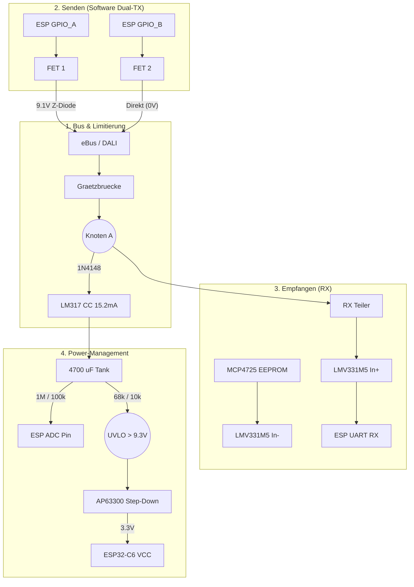

# MEMORY.md: eBus & DALI Smart Interface (ESP32-C6)
*Stand: Design Freeze - Hardware Architektur*

## 1. Kern-Konzept (Energy Harvesting)
Das System arbeitet komplett netzteilfrei ("Bus-powered"). Es entnimmt dem Bus (24V eBus oder 16V DALI) einen streng limitierten Strom, um einen lokalen Hochspannungs-Tank zu füllen. Aus diesem Tank wird ein Step-Down-Wandler gespeist, der die 3.3V fuer den ESP32-C6 erzeugt.

## 2. Die finalen Parameter & Berechnungen

### 2.1 Strombegrenzung (Constant Current)
* **Bauteil:** LM317
* **Widerstand (OUT zu ADJ):** 82 Ohm
* **Konstanter Ladestrom:** 15.2 mA (Sicher unter dem 18mA eBus Limit. Fuer DALI toleriert als "Multi-Device-Load").

### 2.2 Der Energy-Tank (Kaltstart-sicher)
* **Bauteil:** 4700 uF / 25V (Low-ESR, THT Elko).
* **Warum:** Der ESP32-C6 benoetigt beim Boot/DHCP-Handshake ca. 430 mJ. Der 4700 uF Tank puffert diese Energie selbst bei der niedrigeren 16V DALI-Spannung zuverlaessig ab, ohne dass die Spannung zu stark einbricht.

### 2.3 Under-Voltage Lockout (UVLO)
Verhindert Boot-Loops, indem der 3.3V-Regler erst bei genug Tank-Druck startet.
* **Spannungsteiler am EN-Pin:** R_top = 68 kOhm, R_bottom = 10 kOhm.
* **Start-Schwelle:** Der ESP32 bootet exakt ab **9.3V** Tankspannung.

### 2.4 Tank-Level Ueberwachung (ADC)
Die Software muss wissen, ob genug Energie fuer einen WLAN-Burst da ist.
* **Hochohmiger Teiler:** 1 MOhm (an Tank) / 100 kOhm (an GND) -> Teilerfaktor 11.0.
* **Glattung:** 100 nF Kerko parallel zu den 100 kOhm.
* **Stromverlust:** Nur 18 uA bei 20V.

## 3. Die Signalpfade (Dual-Use ohne Jumper)

### 3.1 Empfang (RX)
* **Komparator:** LMV331M5 (SOT-23-5). Modern, 3.3V-optimiert, ultra-low power (60 uA). Ersetzt den alten LM393.
* **Dynamische Schwelle:** MCP4725 (I2C DAC). Sein integriertes EEPROM liefert beim Kaltstart sofort die korrekte Referenzspannung (ca. 16V-Mitte fuer eBus, ca. 8V-Mitte fuer DALI), noch bevor der ESP32 gebootet hat.

### 3.2 Senden (TX) per ESP32 GPIO-Matrix
Anstatt Jumper zu setzen, nutzen wir zwei parallele Sende-FETs. Die ESP32-Software routet das UART-TX Signal auf den jeweils benoetigten Pin:
* **eBus Modus (GPIO_A):** FET 1 zieht den Bus ueber eine **9.1V Z-Diode** (Normkonform).
* **DALI Modus (GPIO_B):** FET 2 zieht den Bus **direkt auf Masse** (0V, Normkonform).

## 4. Finale Stueckliste (Kern-BOM)
| Bauteil | Typ / Wert | Funktion |
| :--- | :--- | :--- |
| MCU | ESP32-C6-MINI-1 | Logik & WiFi/Thread |
| Limiter | LM317 | 15.2mA Konstantstrom (82 Ohm) |
| Tank | 4700 uF / 25V | Energiepuffer (THT, Low-ESR) |
| Buck | AP63300 | 3.3V Regler (mit 4.7 uH Spule) |
| Comp | LMV331M5 | RX Signal-Digitalisierung |
| DAC | MCP4725 | I2C Referenz mit EEPROM |
| Diode | 1N4148 / Schottky | Blockiert Rueckfluss in den Bus |

## 5. System-Architektur

