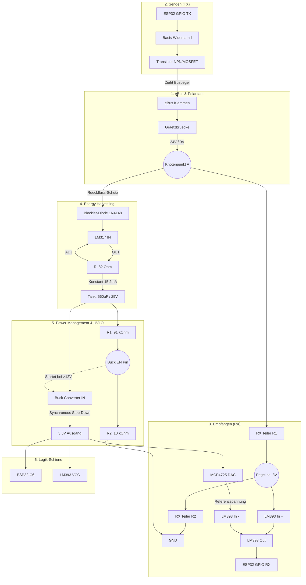

# Hardware-Design Spezifikation: Smart eBus Interface C6 (Energy Harvesting Edition)

  

## 1. Architektur-Uebersicht

Dieses Design ermoeglicht den **vollstaendig netzteilfreien Betrieb** eines ESP32-C6 direkt am eBus (24V). 
Um die strengen eBus-Spezifikationen (max. 18 mA Stromentnahme) einzuhalten und gleichzeitig die hohen Sendestromspitzen des WLAN/Thread-Moduls (bis zu 400 mA) abzufangen, nutzt das Design eine **High-Voltage Energy Harvesting** Architektur.

Der Kern des Systems ist ein lokaler Energiespeicher (Tank) auf dem 20V-Spannungsniveau, der langsam und streng limitiert geladen wird. Der ESP32-C6 und die eBus-Leselogik werden durch diesen Tank versorgt, getrennt von der sensiblen Bus-Kommunikation.

---

## 2. Energie-Konzept & Berechnungen

### 2.1 Strombegrenzung (Der Limiter)
Um den Bus nicht zu ueberlasten, arbeitet ein **LM317** als analoge Konstantstromquelle.
* **Widerstand:** R = 82 Ohm zwischen OUT und ADJ.
* **Ladestrom:** I = 1.25V / 82 Ohm = **15.2 mA**
* **Fazit:** Das System bleibt garantiert unter dem 18mA Limit des eBus.

### 2.2 Der High-Voltage Tank
Die gepufferte Energie waechst quadratisch zur Spannung. Wir speichern die Energie bei ca. 19.5V (24V eBus abzaeglich Spannungsabfall von Graetzbruecke, Blockier-Diode und LM317-Dropout).
* **Kondensator:** KEMET A768MS567M1ELAE017 (Solid Polymer, 560 uF, 25V, 17 mOhm ESR).
* **Gespeicherte Energie:** E = 0.5 * 560uF * (19.5V)^2 = **106 mJ**
* **Bedarf WiFi-Burst:** 400mA * 3.3V * 5ms = **6.6 mJ**
* **Ladezeit (0 auf 100%):** t = C * (dU / I) = 560uF * (19.5V / 15.2mA) = **720 ms**
* **Fazit:** Der Tank speichert das 16-fache eines WLAN-Bursts. Der Systemstart erfolgt in unter einer Sekunde.

### 2.3 Under-Voltage Lockout (UVLO)
Ein synchroner Step-Down-Wandler (z. B. AP63300) erzeugt die 3.3V fuer den ESP32-C6. Damit der leere Tank beim Booten nicht sofort durch den ESP wieder entladen wird, blockiert ein Spannungsteiler den Enable-Pin (EN) des Wandlers, bis genug Energie vorhanden ist.
* **Spannungsteiler:** R1 = 91 kOhm (an V_Tank), R2 = 10 kOhm (an GND).
* **Einschalt-Schwelle (V_EN = 1.2V):** Startet bei V_Tank = **12.1 V**.
* **Maximalspannung am EN-Pin:** Bei 19.5V Tankspannung liegen sichere **1.93 V** am EN-Pin an.

---

## 3. Signalwege (eBus Interface)

Da der Tank-Kondensator die Daten-Signale glattbuegeln wuerde, ist der Datenpfad vom Strompfad getrennt.

### 3.1 Empfangspfad (RX) & Rueckfluss-Schutz
1. **Graetzbruecke:** Sorgt fuer Verpolungssicherheit an den eBus-Klemmen.
2. **Knotenpunkt A:** Hier liegt das reine, schwankende eBus-Signal an.
3. **Blockier-Diode (1N4148):** Trennt Knotenpunkt A vom LM317. Faellt der Bus auf 9V (Datenuebertragung), sperrt die Diode. Der Tank entlaedt sich *nicht* rueckwaerts in das Empfangssignal.
4. **Komparator (LM393):** Ein Spannungsteiler an Knotenpunkt A bricht das 24V/9V Signal auf 3V/1V Level herunter. Ein I2C-DAC (**MCP4725**) liefert die intelligente Referenzspannung zum Vergleichen.

### 3.2 Sendepfad (TX)
Ein Standard-NPN-Transistor oder MOSFET wird vom ESP32-GPIO gesteuert und zieht die Spannung vor der Graetzbruecke gezielt auf das 9V-Logikniveau herunter.

---

## 4. System-Schaltplan

---

## 5. Kern-Stueckliste (Key BOM)

| Komponente | Typ | Funktion | Spezifikation |
| :--- | :--- | :--- | :--- |
| **MCU** | **ESP32-C6-MINI-1** | Logik, Thread, WiFi, BLE | RISC-V, Low Power |
| **Tank-Kondensator** | **KEMET A768MS567M1ELAE017** | Energiespeicher | Solid Polymer, 560uF, 25V, 17mOhm ESR |
| **Konstantstrom-Quelle** | **LM317** | Limitierung Bus-Strom | Eingestellt auf 15.2 mA (mit 82 Ohm) |
| **Buck Converter** | **AP63300** (oder aehnlich) | Step-Down | Sync-Rectifier, Vin > 24V |
| **Komparator** | **LM393** | Signal-Digitalisierung | Standard Dual-Comparator |
| **DAC** | **MCP4725** | Dynamische Referenz | I2C gesteuert, EEPROM |
| **Blockier-Diode** | **1N4148** oder Schottky | Signal-Schutz | Verhindert Rueckwaerts-Entladung |

