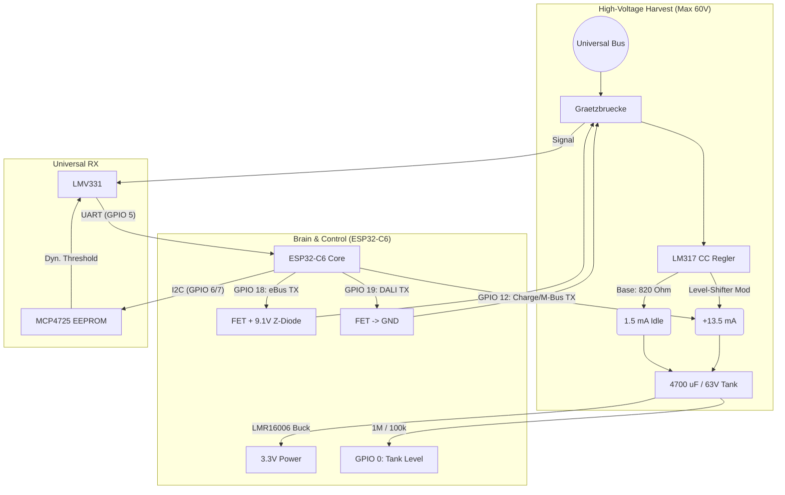

# Das Universal VoltBus Gateway (ESP32-C6)
*Hardware Architecture & Design Freeze für GenAI Control*

Dieses Design vereint Spannungs- und Strommodulation, um nahezu alle gängigen 2-Draht-Gebäudebusse (eBus, EMS, DALI, OpenTherm, M-Bus) netzteilfrei auszulesen und zu steuern.

---

## 1. Energy Harvesting & Power Management (Die 60V Basis)
Das System ist auf Überleben bei Kaltstarts und den Umgang mit Hochspannungs-Bussen (M-Bus bis 42V) ausgelegt.

* **Eingangsschutz:** Graetzbrücke (Verpolungsschutz) + 1N4148 Diode (verhindert das Zurückfließen der Tankenergie bei einem Bus-Low-Pegel).
* **Smart Current Limiter (LM317 + Level Shifter):**
    * **Basis-Strom (Idle):** Ein 820 Ohm Widerstand am LM317 sorgt für sture, normkonforme **1,5 mA**. (Überlebenswichtig für M-Bus/DALI Idle).
    * **Charge-Boost (+13,5 mA):** Über einen NPN/PNP-Level-Shifter (gesteuert durch den ESP32) kann ein 91 Ohm Widerstand parallelgeschaltet werden. Liefert volle **15 mA** für schnelles Laden an eBus/EMS.
* **Der Hochvolt-Tank:** **4700 µF / 63V** Elektrolytkondensator (Low-ESR). Sichert den Systemstart auch bei massiven Spannungseinbrüchen.
* **Buck-Converter:** Ein echter Hochvolt-Regler (z. B. **LMR16006**), der Eingangsspannungen bis 60V auf stabile 3,3V für den ESP32-C6 herunterbricht.
* **Under-Voltage Lockout (UVLO):** Spannungsteiler am EN-Pin des Buck-Reglers, um den Kaltstart exakt auf z. B. 9,3V oder 12V (je nach finaler Widerstandswahl) festzunageln. Verhindert Boot-Loops.
* **Tank Level ADC:** Hochohmiger Spannungsteiler (1 MΩ / 100 kΩ) + 100 nF Kerko. Erlaubt der Software, den Füllstand des Tanks mit nur 18 µA Verlust zu messen.

---

## 2. Der Empfangspfad (Universal RX Level)
Passt sich per Software an die Ruhepegel und Spannungsabfälle des jeweiligen Busses an.

* **Bus-Messung:** Die Bus-Spannung wird über einen Spannungsteiler heruntergebrochen.
* **Referenz-Spannung (DAC):** **MCP4725** (I2C). Sein integriertes EEPROM liefert beim Kaltstart sofort die korrekte Referenzspannung an den Komparator, noch bevor der ESP32 bootet.
* **Digitalisierung (Komparator):** **LMV331M5** (SOT-23-5). Ultra-Low-Power (60 µA). Vergleicht die Bus-Spannung mit der DAC-Referenz und liefert ein sauberes 3,3V Rechtecksignal an den UART-RX des ESP32.

---

## 3. Der Sende-Pfad (Software-Defined TX)
Keine physischen Jumper. Die Firmware entscheidet über die GPIO-Matrix, welche Sende-Methode genutzt wird.

* **TX_V9 (Spannungs-Senke 9V):** Für **eBus / EMS**. Ein N-Channel FET zieht die Busspannung über eine 9,1V Z-Diode herunter.
* **TX_V0 (Spannungs-Senke 0V):** Für **DALI / OpenTherm (Master)**. Ein N-Channel FET zieht den Bus direkt auf Masse (0V) herunter.
* **TX_CURRENT (Strom-Senke / Send-by-Charging):** Für **M-Bus / OpenTherm (Slave)**. Das Senden ("0") erfolgt durch das Pulsen des Charge-Boost-Pins! Der ESP schaltet im Takt der Baudrate die zusätzlichen 13,5 mA des LM317 ein. Der Bus sieht den erhöhten Stromverbrauch als Daten-Bit, während wir gleichzeitig unseren Tank aufladen.

---

## 4. ESP32-C6-MINI-1 GPIO Mapping

| Pin / GPIO | Funktion | Beschreibung |
| :--- | :--- | :--- |
| **3V3 & GND** | Power | Versorgung aus dem LMR16006, sauberes Stern-GND |
| **GPIO 0** | `ADC_TANK` | Tank-Füllstand (1M/47k Teiler) |
| **GPIO 1** | `ADC_BUS` | Rohe Busspannung für Auto-Detection (1M/47k Teiler) |
| **GPIO 5** | `UART_RX` | Digitaler Empfang vom LMV331 Komparator |
| **GPIO 6** | `I2C_SDA` | Datenleitung zum MCP4725 DAC |
| **GPIO 7** | `I2C_SCL` | Taktleitung zum MCP4725 DAC |
| **GPIO 18** | `TX_V9` | Steuert FET 1 (eBus/EMS -> 9.1V Z-Diode) |
| **GPIO 19** | `TX_V0` | Steuert FET 2 (DALI -> 0V GND) |
| **GPIO 12** | `TX_CHARGE` | Steuert den Level-Shifter für +13,5mA am LM317 (Lade-Boost & M-Bus TX) |

---

## 5. System-Architektur

## 6. Die Augen des Agenten (Dual ADC Auto-Detection)
Damit die Software das Protokoll erkennen und das Energy-Management steuern kann. Beide Teiler nutzen **1 MΩ / 47 kΩ** (Max. 60V -> 2,69V am ADC) plus 100 nF Kerko.
* **ADC_BUS (GPIO 1):** Misst die rohe Busspannung vor dem Laderegler. Ermöglicht Auto-Detection (DALI, eBus, M-Bus).
* **ADC_TANK (GPIO 0):** Misst die verfügbare Energie im 63V-Tank für sichere WLAN-Bursts.

## 7. Under-Voltage Lockout (UVLO)
* **Under-Voltage Lockout (UVLO):** Verhindert tödliche Boot-Loops. Ein Spannungsteiler am EN-Pin des LMR16006 (**68 kOhm** zu V_TANK und **10 kOhm** zu GND) hält den Schaltregler physikalisch aus, bis der Kondensator exakt **9,36V** erreicht hat. Erst dann wird der ESP32-C6 mit Energie versorgt.
