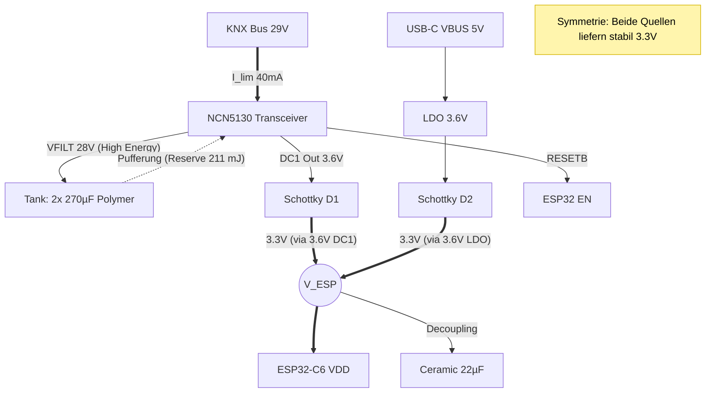

# Hardware-Design Spezifikation: KNX Bus-Powered ESP32-C6

## 1. Management Summary
Dieses Design ermöglicht den **batterielosen Betrieb** eines ESP32-C6 direkt am KNX-Bus. Durch die Nutzung der hohen Busspannung zur Energiespeicherung (High-Voltage-Buffering) werden die hohen Sendestromspitzen des WLAN-Moduls abgefangen, ohne den Bus-Fan-In (max. Stromaufnahme) zu verletzen.

## 2. Power-Anforderungen (ESP32-C6)
Der ESP32-C6 ist effizient, stellt aber gepulste Anforderungen an die Versorgung, die weit über dem liegen, was der KNX-Bus (max. 1.2W) kontinuierlich liefern kann.

| Betriebsmodus | Durchschnittsstrom | Dauer | Spitzenstrom (Peak) | Bemerkung |
| :--- | :--- | :--- | :--- | :--- |
| **Deep Sleep** | 7 µA | Unbegrenzt | - | Reiner Standby |
| **Active RX** | 85 mA | Kontinuierlich | 90 mA | Listen Mode / Thread |
| **Active TX** | 280 - 350 mA | < 5 ms | **400 mA** | WiFi Beacon / Daten (Worst Case) |

* **Das Problem:** Der NCN5130 kann bei 3.3V maximal ca. **270 - 300 mA** kontinuierlich liefern (bei 40mA Fan-In).
* **Die Lücke:** Während eines TX-Bursts fehlen ca. **100 - 130 mA**, die nicht aus dem Bus kommen können.

## 3. Die Lösung: High-Voltage Tank
Anstatt riesige Kondensatoren auf der 3.3V-Seite zu verbauen, speichern wir die Energie auf der **28V-Seite (VFILT)**.
Die Energie in einem Kondensator wächst quadratisch zur Spannung ($E = \frac{1}{2} C U^2$).

### Rechnerischer Nachweis
Wir nehmen den **Worst-Case** an: Einen WiFi-TX-Burst von **400 mA** für **5 ms**.

1.  **Leistungsbedarf Last (ESP):**
    $$P_{Load} = 3.3V \times 0.400A = 1.32 W$$
2.  **Verfügbare Bus-Leistung (Supply):**
    $$P_{Bus} = 29V \times 0.040A \times 0.85 (\eta_{DCDC}) \approx 0.98 W$$
3.  **Leistungsdefizit:**
    $$\Delta P = 1.32 W - 0.98 W = 0.34 W$$
4.  **Energiebedarf aus Puffer (für 5ms):**
    $$E_{Burst} = 0.34 W \times 0.005 s = 1.7 mJ (Milli-Joule)$$

### Puffer-Kapazität (Der Tank)
Wir verwenden **2x 270µF Polymer** parallel = **540 µF** an ca. **28 V**.

* **Gespeicherte Energie im Tank:**
    $$E_{Tank} = 0.5 \times 0.000540 F \times (28V)^2 \approx 211 mJ$$

### Ergebnis
Der Burst entnimmt **1.7 mJ** aus einem Tank, der **211 mJ** enthält.
Der Spannungsabfall am VFILT-Pin beträgt dabei:
$$\Delta U \approx \frac{E_{Burst}}{C \times U} = \frac{0.0017}{0.000540 \times 28} \approx 0.11 V$$

**Fazit:** Die Spannung am Tank sinkt während eines massiven WiFi-Bursts nur von **28.0 V auf ca. 27.9 V**. Der DC/DC-Wandler regelt dies völlig unbeeindruckt aus. Das System verfügt über eine **Sicherheitsreserve von Faktor >100**.

## 4. Kern-Komponenten (BOM)
* **Transceiver:** ON Semi `NCN5130` (DC1 konfiguriert auf 3.6V)
* **MCU:** Espressif `ESP32-C6`
* **Tank (VFILT):** 2x KEMET `A768MS277M1VLAE022` (270µF, 35V, Polymer, AEC-Q200)
* **USB-LDO:** Diodes Inc. `AP2112K-ADJ` (oder `TLV757P`) eingestellt auf **3.6 V**.
* **Oring-Dioden:** 2x Schottky `SS14` (oder `BAT60`)

## 5. Schaltplan-Architektur

## 6. Implementation Details

### A. Spannungseinstellung (Symmetrisch 3.6 V)
Um den Spannungsabfall der Schottky-Dioden (~0.3 V) auszugleichen, werden beide Quellen angehoben:
1.  **KNX (DC1):** Feedback-Widerstände am NCN5130 so dimensionieren, dass $V_{out} = 3.6 V$.
2.  **USB (LDO):** Spannungsteiler am Adjustable LDO auf 3.6 V einstellen.

* **Ergebnis:** Der ESP32 erhält stabil **3.3 V**, weit entfernt vom Brownout-Level (2.8 V).

### B. VFILT Layout Guidelines
Die Verbindung zwischen NCN5130 `Pin VFILT` und dem positiven Pol der Polymer-Elkos muss **niederinduktiv** sein.
* Leiterbahnbreite > 0.6 mm.
* Direkte Anbindung an die GND-Plane.
* Platzierung < 10 mm vom IC entfernt.

### C. Priorisierung
* **Szenario 1 (Nur KNX):** Versorgung rein über DC1 + Tank.
* **Szenario 2 (USB gesteckt):** Da USB eine "harte" Spannungsquelle ist und der NCN strombegrenzt ist, übernimmt der LDO automatisch die Hauptlast. Das schont den Bus während Entwicklungsarbeiten.

### D. USB-C Interface (D+/D- & CC)
Damit der ESP32-C6 korrekt via USB kommuniziert und vom Host Strom erhält, ist folgende Beschaltung nötig:

1.  **CC1 & CC2 (Power Negotiation):**
    * Beide Pins müssen separat über je einen **5.1 kΩ Widerstand** gegen GND gezogen werden.
    * *Funktion:* Dies signalisiert dem USB-C Host (z.B. Laptop), dass ein "Device" angeschlossen ist und aktiviert die 5V VBUS Spannung. Ohne diese Widerstände liefert ein reines USB-C Netzteil keine Spannung!

2.  **D+ & D- (Datenleitungen):**
    * Der ESP32-C6 hat einen internen USB-PHY.
    * **Mapping:** D- an GPIO 12, D+ an GPIO 13.
    * In die Leitungen D+ und D- (zwischen USB-Buchse und ESP32) je einen Widerstand von **470 Ω**.
    * *Funktion:* Dies begrenzt den Fehlstrom auf ein unkritisches Niveau (< 10 mA), ohne die USB Full-Speed Kommunikation (12 Mbps) zu stören.

3.  **ESD-Schutz:**
    * Optional: Ein SR05 oder USBLC6-2 Baustein an D+/D- und VBUS schützt den ESP32 vor statischen Entladungen beim Einstecken.

4.  **Gleichtaktdrossel (Empfohlen für CE):**
    * Ein Footprint für eine Common Mode Choke (z.B. **Würth WE-CNSW**) sollte in den D+/D- Leitungen vorgesehen werden.
    * *Initial:* Kann mit 0 Ω Brücken bestückt werden, ist aber der "Lebensretter" bei EMV-Tests.
