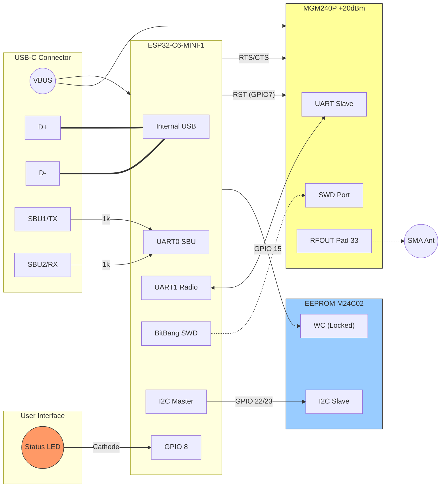

# Busware "SBU-Native" Combo Stick Specification

**Version:** 1.8 (Internal Flow Control)
**Architecture:** Dual-Path Gateway Stick
**Modules:** Espressif ESP32-C6-MINI-1 + Silicon Labs MGM240PA32VNN3 + ST M24C02

---

## 1. Abstract

This design defines the ultimate Zigbee/Matter/Thread stick. It combines a powerful **ESP32-C6** Host with a High-Power **MGM240P** Radio (+20 dBm) and secure storage.

**Key Features:**
* **Dual-Path:** Works as standard USB Device (Legacy) AND raw UART Device (SBU-Native).
* **Flow Control:** Hardware RTS/CTS between Host and Radio for high reliability.
* **Self-Healing:** ESP32 can reset and re-flash the Radio via internal SWD.
* **Identity Storage:** On-board **M24C02 EEPROM** (Hardware Write Protected).
* **High Power RF:** External Antenna via SMA/U.FL (+20 dBm).

---

## 2. Bill of Materials (Critical Components)

| Component | Part Number | Function | Critical Spec |
| :--- | :--- | :--- | :--- |
| **Host MCU** | **ESP32-C6-MINI-1** | Controller & USB Bridge | RISC-V, USB-Serial-JTAG |
| **Radio Module** | **MGM240PA32VNN3** | Zigbee/Thread Radio | +20dBm, **RF Pin (No PCB Ant)** |
| **EEPROM** | **ST M24C02-R** | Persistent Storage | 2 Kbit I2C, Hardware WC Pin |
| **LDO Regulator**| **TI TLV75733** | Power Supply | 3.3V, **1A Output**, Low Noise |
| **VBUS Ferrite** | **Würth 742792040** | Power Filter | **Z>600R, I>1A, R_DC<0.2R** |
| **Data CMC** | **Murata DLW21SN900HQ2**| EMI Filter (D+/D-) | 90 Ohm @ 100MHz |
| **ESD Protection**| **ST USBLC6-2** | Input Protection | Ultra-low C (<1pF) |
| **Status LED** | Generic 0603 | Status Indication | **Low Active** (Anode to 3V3) |

---

## 3. Pin Mapping

### 3.1 External Interface (USB-C Plug)

| Pin | Name | Direction | Connected To | Note |
| :--- | :--- | :--- | :--- | :--- |
| **A6/B6** | **D+** | I/O | **ESP32 GPIO 13** | Via CMC & ESD Protection |
| **A7/B7** | **D-** | I/O | **ESP32 GPIO 12** | Via CMC & ESD Protection |
| **A8** | **SBU1** | Output | **ESP32 GPIO 16** | **1kΩ Series Resistor** |
| **B8** | **SBU2** | Input | **ESP32 GPIO 17** | **1kΩ Series Resistor** |
| **CC1/2**| **CC** | Input | GND | **5.1kΩ Pull-Down** |

### 3.2 Internal Interconnect (ESP32 -> MGM240P)

| Signal | ESP32 Pin | MGM240P Pin | Pad # | Function |
| :--- | :--- | :--- | :--- | :--- |
| **UART_TX** | **GPIO 4** | **PA06** (RX) | 13 | Payload Data (C6 -> MGM) |
| **UART_RX** | **GPIO 5** | **PA05** (TX) | 12 | Payload Data (C6 <- MGM) |
| **UART_RTS**| **GPIO 6** | **PA04** (CTS) | 11 | Flow Control (C6 -> MGM) |
| **UART_CTS**| **GPIO 3** | **PA03** (RTS) | 10 | Flow Control (C6 <- MGM) |
| **SWCLK** | **GPIO 0** | **PA01** | 8 | **Factory Flashing / Rescue** |
| **SWDIO** | **GPIO 2** | **PA02** | 9 | **Factory Flashing / Rescue** |
| **RESET** | **GPIO 7** | **RESETn** | 31 | Hard Reset (Active Low) |

### 3.3 Peripherals (ESP32 Local)

| Signal | ESP32 Pin | Target Device | Function | Note |
| :--- | :--- | :--- | :--- | :--- |
| **I2C_SDA** | **GPIO 22** | M24C02 SDA | I2C Data | **2.2kΩ Pull-Up** |
| **I2C_SCL** | **GPIO 23** | M24C02 SCL | I2C Clock | **2.2kΩ Pull-Up** |
| **EEPROM_WC**| **GPIO 15** | M24C02 WC | Write Control | **4.7kΩ Pull-Up** (Default: Locked) |
| **LED** | **GPIO 8** | Status LED | Visual | **Low Active** (Resistor to 3V3) |

---

## 4. RF & Layout Guidelines (MGM240P VNN3)

1.  **RF Path:** Route from **Pad 33 (RFOUT)** to SMA/U.FL connector (50 Ohm Microstrip).
2.  **Grounding:** Pads **32 and 34** (flanking RFOUT) must connect immediately to the reference Ground plane.
3.  **Flow Control:** Route RTS/CTS traces parallel to TX/RX to maintain signal integrity.

---

## 5. Wiring Diagram

