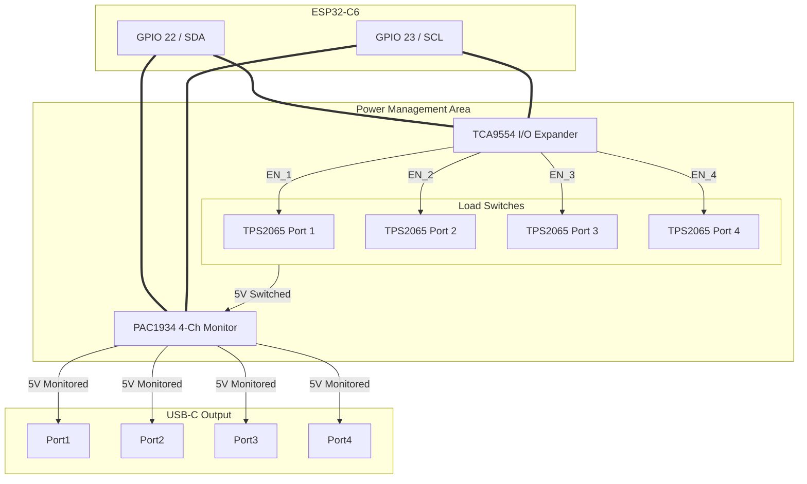

# Specification: Host Interface & Power Management

**Subsystem:** VBUS Control & Telemetry
**Target:** bw-sbu-bridge Mainboard
**Revision:** v3 (Complete with Code)


## 1. The Critical Necessity of VBUS Control

In standard USB hubs, VBUS (5V Power) is "Always On". For the **bw-sbu-bridge**, individual VBUS switching per port is **mandatory** for three reasons:

### 1.1 Firmware "Auto-Boot" Sequence
As defined in the Stick Specification (v6), the Stick only enters bootloader mode if:
1.  The UART RX line is pulled LOW.
2.  **THEN** Power (VBUS) is applied (Rising Edge of EN).

> Without controllable VBUS, the user would have to physically unplug and replug the stick while holding a button. VBUS switching allows fully remote firmware updates.

### 1.2 "Hard Reset" Recovery
RF Stacks (Zigbee/Z-Wave) can occasionally freeze in a state where a soft-reset (via UART command) fails. A physical power cycle (VBUS OFF -> Wait 1s -> VBUS ON) is the only reliable way to recover a dead stick without physical access.

### 1.3 PoE Power Budget Protection
The Gateway is powered via PoE (802.3af), limited to ~15 Watts. If four sticks simultaneously transmit at high power, the system might brownout. VBUS control allows the Host (ESP32-C6) to implement "Staggered Spin-up" (turning sticks on one by one) to limit inrush current.

---

## 2. Hardware Architecture: The Power Subsystem

Since the ESP32-C6 has limited GPIOs (mostly used by SPI/UART), the power management is offloaded to the **I2C Bus**.

### 2.1 Component Selection

| Component | Type | Function | Description |
| :--- | :--- | :--- | :--- |
| **TCA9554** | I/O Expander (I2C) | **VBUS Switching** | Controls the Enable Pins of the Load Switches. |
| **TPS2065** | Power Switch | **Protection** | Current-limited USB Load Switch (1A limit). Prevents short circuits from killing the Gateway. |
| **PAC1934** | Power Monitor (I2C) | **Telemetry** | Native **4-Channel** DC Power/Energy Monitor. Measures VBUS Volts & Amps for **each stick**. |

### 2.2 Schematic Concept



---

## 3. Host Connector Definition (USB-C Receptacle)

Wiring for the 4x Downstream Ports on the **bw-sbu-bridge** PCB.

| Pin | Name | Direction (Host View) | Connected To | Role |
| :--- | :--- | :--- | :--- | :--- |
| **A4, B4, A9, B9** | **VBUS** | **Power Source** | **PAC1934 Output** | Provides switched, monitored 5V. |
| **A1, B1, A12, B12** | **GND** | Power | GND Plane | Common Ground. |
| **A6, B6** | **D+** | I/O | **FE1.1s (Hub)** | USB 2.0 Data (Maintenance). |
| **A7, B7** | **D-** | I/O | **FE1.1s (Hub)** | USB 2.0 Data (Maintenance). |
| **A8** | **SBU1** | **Input (RX)** | **WK2124 (RX Pin)** | Host receives data from Stick-TX. |
| **B8** | **SBU2** | **Output (TX)** | **WK2124 (TX Pin)** | Host transmits to Stick-RX. **Used for Boot-Break.** |
| **A5** | **CC1** | Output | **Rp (56k to 5V)** | Pull-Up to advertise "Source". |
| **B5** | **CC2** | Output | **Rp (56k to 5V)** | Pull-Up to advertise "Source". |

> **Important:** The Host acts as a USB-C "Source". Therefore, **CC1 and CC2 must have 56k Ohm pull-up resistors to 5V** (or equivalent current source). This ensures that standard USB-C cables activate VBUS detection on the Stick side (which has 5.1k Pull-Downs).

---

## 4. Firmware Implementation (Power & Boot)

### 4.1 I/O Expander Mapping (TCA9554)
Address: `0x20`

| Bit | Name | Direction | Function |
| :--- | :--- | :--- | :--- |
| **P0..P3** | PWR_EN_1..4 | OUT | Enable Power Stick 1..4 (High = ON) |
| **P4..P7** | LED_1..4 | OUT | Status LED Stick 1..4 |

### 4.2 Code Example: Auto-Boot Sequence

This function demonstrates how to force a specific Stick Port into Serial Bootloader mode using the "Power Cycle + UART Break" method.

```c
// Dependencies: I2C Driver, WK2124 Driver

void enter_bootloader(int port_idx) {
    printf("Attempting to boot Stick 0 into Flashing Mode...\n", port_idx);

    // 1. Cut Power (Via TCA9554)
    // Write LOW to the corresponding bit P0..P3
    io_expander_set_power(port_idx, false);
    vTaskDelay(pdMS_TO_TICKS(500)); // Ensure capacitors discharge

    // 2. Pull UART RX Low (Break Signal)
    // The WK2124 supports sending a "Line Break" (TX Low).
    // This pulls SBU2 Low -> 1k Resistor -> GPIO9 Low.
    wk2124_set_break_state(port_idx, true);

    // 3. Restore Power (Via TCA9554)
    // Write HIGH to the corresponding bit P0..P3
    io_expander_set_power(port_idx, true);
    
    // 4. Wait for Stick Power-On Reset
    // The stick needs ~10-20ms for the RC circuit on EN pin.
    vTaskDelay(pdMS_TO_TICKS(50));

    // 5. Release Break (Return to Idle High)
    // Stick has sampled GPIO9 by now. We can resume normal UART.
    wk2124_set_break_state(port_idx, false);
    
    printf("Stick 0 should now be in Download Mode.\n", port_idx);
    // Now start the esp-serial-flasher protocol...
}
```
