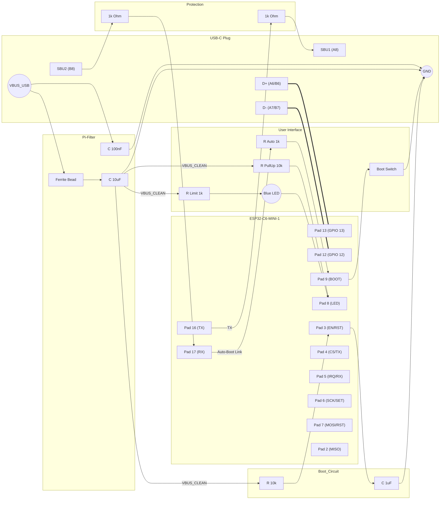

# Specification: Busware Stick (ESP32-C6-MINI Edition)

**Module:** Espressif ESP32-C6-MINI-1 (PCB Antenna) / -1U (U.FL)
**Application:** Dual-Path RF Stick (USB & SBU)
**Revision:** v10 (Added Power Filtering)


## 1. Pin Mapping Overview

This specification fixes the pin assignment for the production version using the **ESP32-C6-MINI** module. 

### 1.1 Interface A: Host Connection (USB-C Plug)

| Signal Name | ESP32-C6 Pin | Module Pad | USB-C Pin | Note |
| :--- | :--- | :--- | :--- | :--- |
| **USB_D_N** | GPIO 12 | Pad 12 | **A7 / B7** | USB 2.0 Data Negative |
| **USB_D_P** | GPIO 13 | Pad 13 | **A6 / B6** | USB 2.0 Data Positive |
| **SBU_TX** | GPIO 16 | Pad 16 | **A8** | High-Speed UART TX (to Gateway) |
| **SBU_RX** | GPIO 17 | Pad 17 | **B8** | High-Speed UART RX (from Gateway) |

### 1.2 User Interface

| Signal Name | ESP32-C6 Pin | Function | Wiring | Note |
| :--- | :--- | :--- | :--- | :--- |
| **STATUS_LED** | **GPIO 8** | LED Output | **Active Low** + **10k Pull-Up** | Safe for Strapping (Fail-Safe). |
| **BOOT_BTN** | **GPIO 9** | Manual Boot | Pull Low to GND | See Auto-Boot Circuit. |

### 1.3 Interface B: Transceiver Connection (Select One)

#### Option B1: SPI Transceiver (e.g., CC1101, SX1276)
| Signal Name | ESP32-C6 Pin | Function | Note |
| :--- | :--- | :--- | :--- |
| **RF_CSN** | **GPIO 4** | SPI Chip Select | |
| **RF_IRQ** | **GPIO 5** | Interrupt | |
| **RF_SCK** | **GPIO 6** | SPI Clock | |
| **RF_MOSI** | **GPIO 7** | SPI Data Out | |
| **RF_MISO** | **GPIO 2** | SPI Data In | GPIO 2 is safe for SPI |
| **RF_GDO2** | **GPIO 0** | Secondary IRQ | Optional |

#### Option B2: Serial Transceiver (e.g., HM-TRP)
| Signal Name | ESP32-C6 Pin | Function | Note |
| :--- | :--- | :--- | :--- |
| **RF_TX** | **GPIO 4** | UART TX | MCU sends to Module |
| **RF_RX** | **GPIO 5** | UART RX | MCU receives from Module |
| **RF_SET** | **GPIO 6** | Config / Mode | |
| **RF_RST** | **GPIO 7** | Reset | |

---

## 2. Power Supply & Filtering

To ensure maximum RF range and stability, the noisy USB VBUS supply must be filtered before reaching the LDO.

### 2.1 Pi-Filter Requirement
Implement a **C-L-C** filter topology immediately at the USB connector:

1.  **C_IN (100nF):** 0402 Ceramic (X7R). Places close to VBUS pins. Filters HF noise.
2.  **L_SERIES (Ferrite Bead):** High-Current Ferrite.
    * **Z @ 100MHz:** > 600 Ohm
    * **I_rated:** > 1000 mA
    * **R_DC:** < 0.2 Ohm (Crucial to minimize voltage drop!)
    * *Recommendation:* Würth WE-CBF Series or Murata BLM21.
3.  **C_BULK (10uF - 22uF):** 0805 Ceramic (X5R/X7R, >10V). Buffers TX current bursts.

---

## 3. Schematic Implementation



---

## 4. Bootloader & Reset Logic

### 4.1 Scenario A: Normal Boot
1.  Gateway sets UART TX (Stick RX) to **Idle High**.
2.  Gateway turns on VBUS.
3.  Stick Power-On Reset (RC Network) holds EN low for ~10ms.
4.  GPIO 9 is pulled **HIGH** via SBU2 (3.3V) and internal pull-ups.
5.  **Result:** Application starts.

### 4.2 Scenario B: Gateway-Forced Boot (Auto-Flash)
1.  Gateway sets UART TX (Stick RX) to **BREAK / LOW**.
2.  Gateway turns on VBUS.
3.  GPIO 9 is pulled **LOW** via `R_AUTO` (1k) because SBU2 is Low.
4.  When EN goes High, Chip detects GPIO 9 Low.
5.  **Result:** Stick enters **Serial Bootloader**.

---

## 5. Critical Layout Requirements

1.  **Antenna Keep-Out (MINI-1):** The top edge (antenna area) must be copper-free on ALL layers.
2.  **USB Impedance:** Route GPIO 12/13 as differential pair (90 Ohm).
3.  **Strapping Pins:**
    * **GPIO 8:** Must be HIGH during boot. **Use the 10k External Pull-Up!**
    * **GPIO 9:** Boot Mode. Keep trace short to SBU resistor.
4.  **Power:** Place Filter components as close to the USB connector as possible.
5.  **Thermal:** Use bottom layer as GND plane for heat dissipation.

---

## 6. Firmware Implementation Examples

### 6.1 Common: Gateway & LED

```cpp
#define PIN_LED 8

void setup() {
    // SBU Link
    Serial0.begin(115200, SERIAL_8N1, 17, 16);
    
    // LED PWM Init (Active Low!)
    ledcAttach(PIN_LED, 5000, 8);
    ledcWrite(PIN_LED, 255); // Start OFF
}

void loop() {
    // Heartbeat Fade
    for (int i = 255; i >= 0; i-=5) { ledcWrite(PIN_LED, i); delay(10); }
    for (int i = 0; i <= 255; i+=5) { ledcWrite(PIN_LED, i); delay(10); }
}
```

### 6.2 Option B1: SPI Transceiver (CC1101)

```cpp
#include <SPI.h>
#define PIN_SPI_SCK  6
#define PIN_SPI_MOSI 7
#define PIN_SPI_MISO 2
#define PIN_SPI_SS   4

void initRF() {
    SPI.begin(PIN_SPI_SCK, PIN_SPI_MISO, PIN_SPI_MOSI, PIN_SPI_SS);
    pinMode(5, INPUT); // IRQ
}
```

### 6.3 Option B2: Serial Transceiver (HM-TRP)

```cpp
#define PIN_RF_SET 6
#define PIN_RF_RST 7

void initRF() {
    pinMode(PIN_RF_SET, OUTPUT);
    pinMode(PIN_RF_RST, OUTPUT);
    Serial1.begin(9600, SERIAL_8N1, 5, 4); // RX=5, TX=4
}
```
