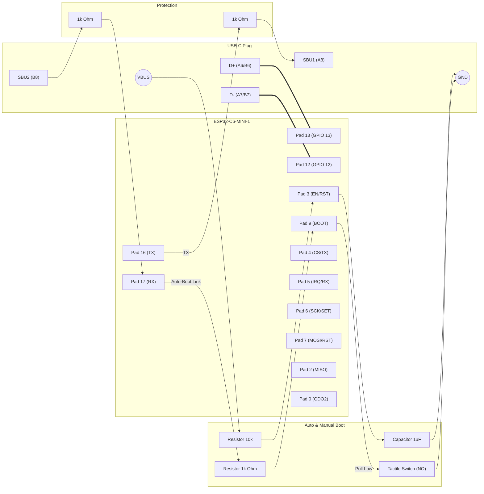

# Specification: Busware Stick (ESP32-C6-MINI Edition)

**Module:** Espressif ESP32-C6-MINI-1 (PCB Antenna) / -1U (U.FL)
**Application:** Dual-Path RF Stick (USB & SBU)
**Revision:** v6 (Final - Cleaned)


## 1. Pin Mapping Overview

This specification fixes the pin assignment for the production version using the **ESP32-C6-MINI** module. 

### 1.1 Interface A: Host Connection (USB-C Plug)

| Signal Name | ESP32-C6 Pin | Module Pad | USB-C Pin | Note |
| :--- | :--- | :--- | :--- | :--- |
| **USB_D_N** | GPIO 12 | Pad 12 | **A7 / B7** | USB 2.0 Data Negative |
| **USB_D_P** | GPIO 13 | Pad 13 | **A6 / B6** | USB 2.0 Data Positive |
| **SBU_TX** | GPIO 16 | Pad 16 | **A8** | High-Speed UART TX (to Gateway) |
| **SBU_RX** | GPIO 17 | Pad 17 | **B8** | High-Speed UART RX (from Gateway) |

---

### 1.2 Interface B: Transceiver Connection (Select One)

Choose the wiring configuration based on the RF chip used. 

#### Option B1: SPI Transceiver (e.g., CC1101, SX1276, RFM69)
Used for "dumb" transceiver chips controlled directly by the ESP32-C6.

| Signal Name | ESP32-C6 Pin | Function | CC1101 Pin | Note |
| :--- | :--- | :--- | :--- | :--- |
| **RF_CSN** | **GPIO 4** | SPI Chip Select | CSN | Active Low |
| **RF_IRQ** | **GPIO 5** | Interrupt | GDO0 / DIO0 | Async signal from RF |
| **RF_SCK** | **GPIO 6** | SPI Clock | SCLK | |
| **RF_MOSI** | **GPIO 7** | SPI Data Out | MOSI | |
| **RF_MISO** | **GPIO 2** | SPI Data In | MISO / GDO1 | GPIO 2 is safe for SPI |
| **RF_GDO2** | **GPIO 0** | Secondary IRQ | GDO2 / DIO1 | Optional (Configurable) |

#### Option B2: Serial Transceiver (e.g., HM-TRP, Integrated Modules)
Used for "smart" RF modules that speak UART and require Mode/Reset control.

| Signal Name | ESP32-C6 Pin | Function | Module Pin | Note |
| :--- | :--- | :--- | :--- | :--- |
| **RF_TX** | **GPIO 4** | UART TX | RXD | MCU sends to Module |
| **RF_RX** | **GPIO 5** | UART RX | TXD | MCU receives from Module |
| **RF_SET** | **GPIO 6** | Config / Mode | ENABLE / SET | Low=Config, High=Data (HM-TRP) |
| **RF_RST** | **GPIO 7** | Reset | RESET | Active Low Reset |

---

## 2. Schematic Implementation (With Auto-Boot)

We utilize the **SBU2 (RX)** line to control the **BOOT (GPIO 9)** pin. This allows the Gateway to force the stick into bootloader mode by pulling the UART line LOW during power-up.



---

## 3. Bootloader Logic Strategy

### 3.1 Scenario A: Normal Boot
1.  Gateway sets UART TX (Stick RX) to **Idle High** (Standard).
2.  Gateway turns on VBUS.
3.  Stick Power-On Reset triggers.
4.  GPIO 9 is pulled **HIGH** via the SBU2 line (3.3V) and internal pull-ups.
5.  **Result:** Application starts.

### 3.2 Scenario B: Gateway-Forced Boot (Flashing)
1.  Gateway sets UART TX (Stick RX) to **BREAK / LOW** (0V).
2.  Gateway turns on VBUS.
3.  Stick Power-On Reset triggers.
4.  GPIO 9 is pulled **LOW** via `R_AUTO` (1k) by the SBU2 line.
5.  **Result:** Stick enters **Serial Bootloader**.
6.  Gateway sends magic byte (0x55) to sync baudrate and begins flash.

### 3.3 Scenario C: Manual PC Boot (USB)
1.  User holds `BTN` (Boot Button).
2.  User plugs in USB-C.
3.  GPIO 9 is pulled **LOW** by button.
4.  **Result:** Stick enters Serial Bootloader (accessible via USB D+/D-).

---

## 4. Critical Layout Requirements

1.  **Antenna Keep-Out (MINI-1 only):** If using the version with PCB antenna, ensure the area under the antenna (top edge of module) is **completely free of copper** on all PCB layers.
2.  **USB Impedance:** Route GPIO 12/13 (Pads 12/13) as a differential pair (90 Ohm differential impedance).
3.  **Strapping Pins:**
    * **GPIO 8 (Pad 8):** Internal pull-up sufficient. Used for JTAG. Keep clean.
    * **GPIO 9 (Pad 9):** Used for Boot. Connect to Auto-Boot Resistor + Switch.
4.  **SPI routing:** Keep SCK, MOSI, MISO traces short.

## 5. Firmware Implementation Examples

### 5.1 Common: Gateway Communication
Regardless of the transceiver, the stick communicates with the Gateway via SBU (UART0).

```cpp
// SBU Link
Serial0.begin(115200, SERIAL_8N1, 17, 16); // RX=17, TX=16
```

### 5.2 Option B1: SPI Transceiver (CC1101)

```cpp
#include <SPI.h>

// Pin Definitions
#define PIN_SPI_SCK  6
#define PIN_SPI_MOSI 7
#define PIN_SPI_MISO 2
#define PIN_SPI_SS   4
#define PIN_RF_IRQ   5
#define PIN_RF_GDO2  0

void setup() {
    // Initialize SPI
    SPI.begin(PIN_SPI_SCK, PIN_SPI_MISO, PIN_SPI_MOSI, PIN_SPI_SS);
    
    // Configure Interrupts
    pinMode(PIN_RF_IRQ, INPUT);
    pinMode(PIN_RF_GDO2, INPUT); // Optional secondary interrupt
    
    // Proceed with CC1101 Init...
}
```

### 5.3 Option B2: Serial Transceiver (HM-TRP)

```cpp
// Pin Definitions
#define PIN_RF_SET 6
#define PIN_RF_RST 7

void setup() {
    // Configure Control Pins
    pinMode(PIN_RF_SET, OUTPUT);
    pinMode(PIN_RF_RST, OUTPUT);
    
    // Enter Config Mode (Example for HM-TRP)
    digitalWrite(PIN_RF_SET, LOW); 
    delay(50);

    // Initialize UART1 for Transceiver
    Serial1.begin(9600, SERIAL_8N1, 5, 4); // RX=5, TX=4
    
    // Send Config Command
    Serial1.print("AA FA F0"); 
}
```
