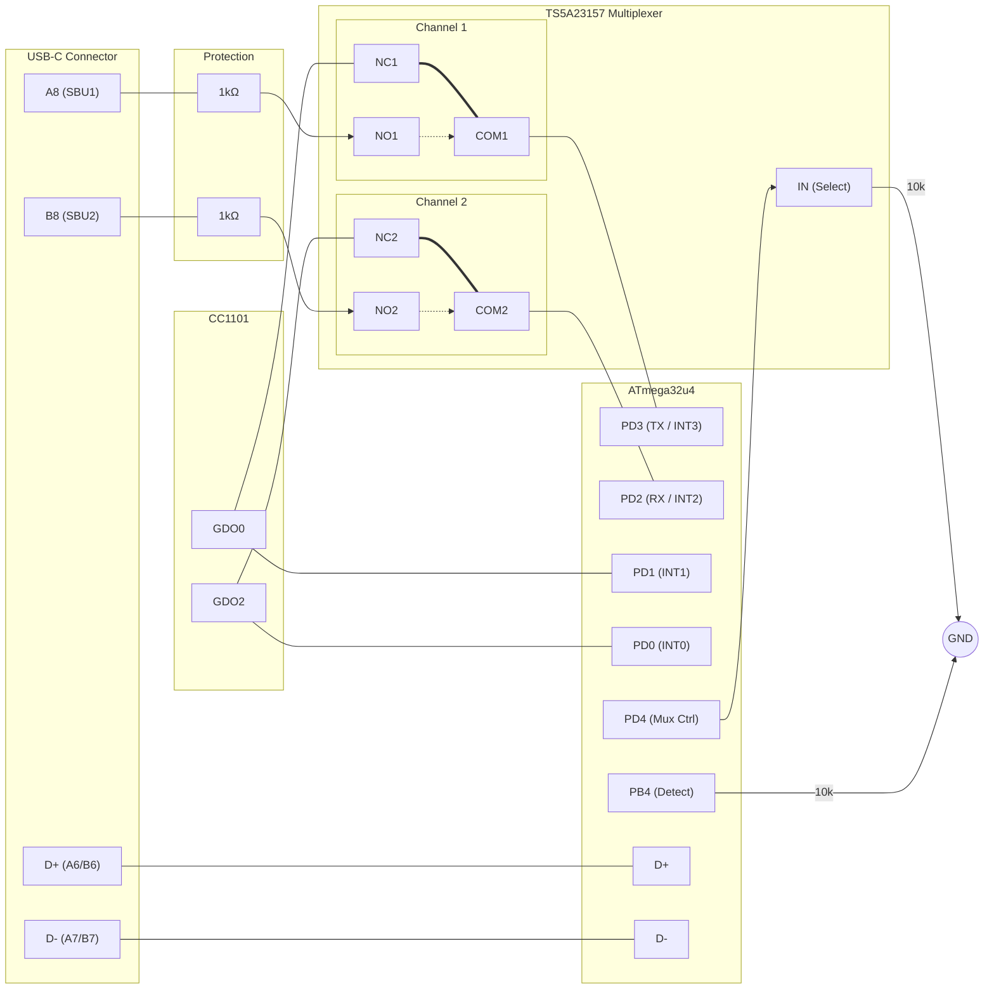

# Hardware Design Specification: Busware CUL-SBU Hybrid (ATmega32u4)

## 1. Abstract
This design defines the "Dual-Path" architecture for ATmega32u4-based CUL sticks. It combines 100%% Legacy Compatibility (culfw) with the new "SBU-Native" UART Interface, selectable via software.

## 2. Pin Mapping Strategy

### The "Conflict"
Legacy firmware expects Radio Signals (GDO0/GDO2) on **PD3/PD2**. SBU-Native firmware needs **PD3/PD2** for Hardware UART (`Serial1`).

### The Solution
We use a Multiplexer to toggle PD2/PD3 and provide a permanent backup path for Radio Signals on **PD0/PD1** (INT0/INT1).

---

## 3. Signal Connections

### A. Radio Interface (CC1101)
Redundant wiring ensures radio access in both modes.

| Signal | Legacy Pin | New "Permanent" Pin | Note |
| :--- | :--- | :--- | :--- |
| **GDO0** | **PD3** (via Switch NC) | **PD1** (INT1) | Interrupt Vector INT1 |
| **GDO2** | **PD2** (via Switch NC) | **PD0** (INT0) | Interrupt Vector INT0 |

### B. Multiplexer Control (TS5A23157)
Controlled by **PD4**. Includes fail-safe for legacy FW.

* **Select Pin:** **PD4** (Output)
* **Fail-Safe:** **10kΩ Pull-Down** Resistor to GND (Default = LOW).

| Mux State | Select (PD4) | PD2/PD3 Function | Note |
| :--- | :--- | :--- | :--- |
| **Legacy** | **LOW** | Connected to **GDO2/GDO0** | Standard CULFW behavior |
| **SBU-Native** | **HIGH** | Connected to **SBU RX/TX** | UART Mode active |

### C. USB-C SBU Interface (UART)
Connecting the ATmega Hardware UART to the USB-C Sideband pins.

| Signal | ATmega Pin | Mux Input | USB-C Pin | Protection |
| :--- | :--- | :--- | :--- | :--- |
| **TX** | PD3 | NO1 | **A8 (SBU1)** | **1kΩ Series Resistor** |
| **RX** | PD2 | NO2 | **B8 (SBU2)** | **1kΩ Series Resistor** |

### D. Hardware Revision Detect
Allows firmware to auto-detect if it is running on SBU-capable hardware.

* **Pin:** **PB4**
* **Circuit:** **10kΩ Resistor to GND**.
* **Detection Logic:**
    1. Set PB4 to `INPUT_PULLUP`.
    2. Read PB4.
    3. **LOW** = New Hardware (Resistor beats internal pull-up).
    4. **HIGH** = Old Hardware (Internal pull-up wins).

---

## 4. Operational Logic

### 1. Boot / Legacy Mode
* **PD4** is Low (Pull-Down). Switch routes GDOs to PD2/PD3.
* **PB4** Check: Firmware detects HIGH (Old HW) or LOW (New HW).
* Legacy FW works out-of-the-box (uses PD2/PD3 for Radio).

### 2. SBU Mode (New Firmware)
1. **Check PB4:** If LOW, we are on SBU Hardware.
2. **Switch Mux:** Set **PD4 = HIGH**.
3. **Init UART:** Start `Serial1` on PD2/PD3.
4. **Init Radio:** Use **PD1 (INT1)** and **PD0 (INT0)** for GDO interrupts instead of PD3/PD2.

---

## 5. Wiring Diagram (Schematic View)

