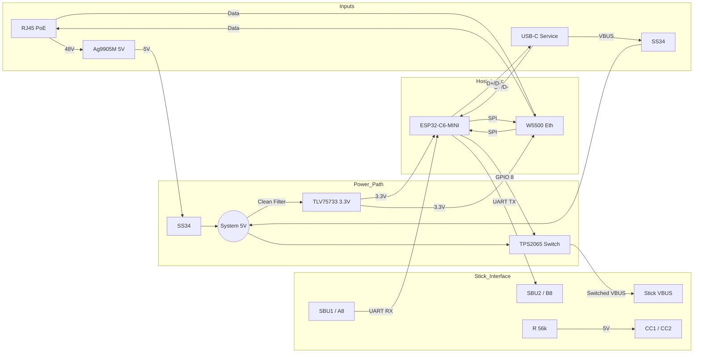

# Specification: Single-Port Industrial SBU Gateway
**Version:** 1.0 (No-Hub / Direct SBU Edition)
**Target:** ESP32-C6-MINI-1 Host

## 2. System Architecture

The gateway is designed as a specialized "Host Controller" for exactly one Busware SBU Stick. Unlike general-purpose USB hubs, this architecture prioritizes low-latency serial communication and remote device management over standard USB protocol compliance.

### 2.1 The "No-Hub" Strategy
In this topology, the **USB Data Lines (D+/D-)** of the stick are **disconnected**. The stick is managed exclusively via the **USB-C Sideband Use (SBU)** pins.
* **Advantage:** Eliminates the need for a USB Hub Controller (e.g., FE1.1s), reducing BOM cost, PCB footprint, and driver complexity.
* **Consequence:** The stick is invisible to a PC connected to the Service Port. Firmware updates for the stick must be proxied by the Gateway Host (Download -> Flash via UART).

### 2.2 Connectivity Ports

#### Port A: Service Uplink (USB-C)
This port connects to a technician's PC or a USB power supply.
* **Function:**
    * **Power:** Backup 5V input (if PoE is unavailable).
    * **Data:** Direct access to the **Gateway Host (ESP32-C6)** via native USB (JTAG/Serial) for debugging or Gateway firmware flashing.
* **Connection:** Directly wired to ESP32-C6 GPIO 12 (D-) and GPIO 13 (D+).

#### Port B: Stick Interface (USB-C)
This port hosts the Busware SBU Stick (Zigbee/Thread/CUL).
* **Function:**
    * **Payload:** Raw UART communication (High-Speed).
    * **Control:** Physical "Hard Reset" capability via VBUS toggling.
    * **Boot Mode:** Forced entry into Stick Bootloader via UART Break signal.
* **Connection:** Wired to ESP32-C6 UART1 (GPIO 4/5). **D+/D- are floating.**

#### Port C: Ethernet (RJ45)
* **Function:** Primary network uplink and power source (PoE).
* **Controller:** WIZnet W5500 via SPI.

---

## 3. Hardware Implementation & Wiring

### 3.1 Wiring Map (ESP32-C6-MINI-1)

The following table defines the critical connections for the Host MCU.

| Pin Name | GPIO | Function | Connection Target | Note |
| :--- | :--- | :--- | :--- | :--- |
| **USB_D-** | **12** | USB | **Service Port A7/B7** | Gateway Debugging |
| **USB_D+** | **13** | USB | **Service Port A6/B6** | Gateway Debugging |
| **U1TXD** | **4** | UART TX | **Stick Port B8 (SBU2)** | Sends data to Stick |
| **U1RXD** | **5** | UART RX | **Stick Port A8 (SBU1)** | Receives data from Stick |
| **MTMS** | **8** | Output | **TPS2065 Enable** | Active High (VBUS ON) |
| **MISO** | **19** | SPI | **W5500 MISO** | Ethernet Data In |
| **MOSI** | **20** | SPI | **W5500 MOSI** | Ethernet Data Out |
| **CLK** | **21** | SPI | **W5500 SCK** | Ethernet Clock |
| **CS** | **18** | SPI | **W5500 SCSn** | Ethernet Chip Select |

> **Critical Note on SBU Wiring:**
> The Gateway acts as the "Host". According to the `host_interface_spec.md`, the Host receives on **SBU1 (A8)** and transmits on **SBU2 (B8)**. This matches the Stick specification where the Stick transmits on A8 and receives on B8.

### 3.2 Power Architecture (Industrial Grade)

The system utilizes a "Split-Source" topology with passive priority.

1.  **Sources:**
    * **Primary:** PoE via **Ag9905M** (5V / 1.8A).
    * **Secondary:** USB-C VBUS (5V / 3A).
2.  **Selection (Diode ORing):**
    * 2x **SS34** Schottky Diodes combine the sources.
    * **Priority:** PoE takes natural priority because the Ag9905 delivers a regulated 5.0V directly at the PCB, whereas USB VBUS often drops to ~4.7V-4.8V due to cable resistance.
3.  **Regulation:**
    * **System 3.3V:** Generated via **TLV75733** (1A LDO) for ESP32 and W5500.
    * **Stick 5V:** The Stick receives the raw "OR-ed" 5V rail via the **TPS2065** switch. The stick handles its own 3.3V conversion.

### 3.3 Justified Bill of Materials (BOM)

| Component | Selected Part | Justification | Reference |
| :--- | :--- | :--- | :--- |
| **Host MCU** | **ESP32-C6-MINI-1** | Native support for Matter/Thread/Zigbee and USB-Serial-JTAG. Compact footprint. | |
| **PoE Module** | **Silvertel Ag9905M** | **9 Watt** output provides ~50% headroom for Stick TX bursts + Host operations. Compact industrial isolation (1.5kV). | |
| **Ethernet** | **WIZnet W5500** | Proven SPI-to-Ethernet bridge. Simpler PCB layout than RMII PHYs. Drivers available in ESP-IDF. | |
| **VBUS Switch** | **TI TPS2065** | Mandatory for "Hard Reset" recovery of frozen sticks. Includes current limiting (short-circuit protection). | |
| **LDO Reg.** | **TI TLV75733** | High PSRR, 1A output. Recommended in stick guidelines for optimal RF performance. | |
| **ESD Protection** | **ST USBLC6-2** | Ultra-low capacitance (<1pF) required for Service Port USB D+/D- integrity. | |
| **Surge Prot.** | **SMAJ15A** | 15V TVS Diode. Protects the internal 5V rail against spikes from hot-plugging cheap USB chargers. | |
| **EMI Filter** | **DLW21SN900HQ2** | Common Mode Choke. Mandatory on USB Uplink to prevent the cable from acting as an antenna. | |

### 3.4 Schematic Diagram (Concept)

### 3.5 Specific Layout Requirements
1.  **CC Configuration:** The Stick Port **CC1 and CC2** pins must have **56kΩ Pull-Up resistors** to 5V. This identifies the Gateway as a "Source" to the Stick.
2.  **ESD Placement:** The `USBLC6-2` (Service Port) and `SRV05-4` (Stick SBU lines) must be placed immediately behind the connectors.
3.  **Thermal:** The area under the Ag9905M and the ESP32-C6 requires a solid GND plane on the bottom layer for heat dissipation.
